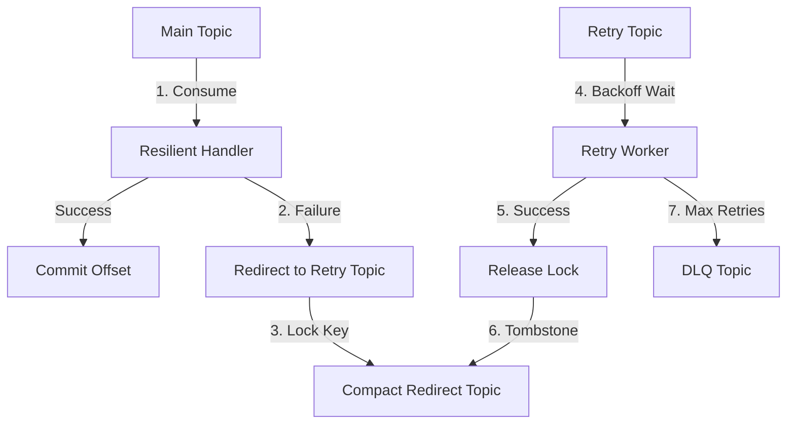

# Kafka Resilience

A Go library for **non-blocking Kafka consumer retries** with **strict per-key ordering guarantees**.

When a message fails, it is redirected to a retry topic without blocking the partition. A distributed lock (via a compacted Kafka topic) ensures that subsequent messages for the same key are held until the failed message is resolved — preserving ordering even across multiple consumer instances.

For the design rationale and deep dive into the pattern, see the [Kafka Ordered Retries](https://devgeist.hashnode.dev/series/kafka-ordered-retries) blog series.

## Features

- **Non-blocking retries** — failed messages move to a separate retry topic, so the main consumer is never stalled.
- **Strict per-key ordering** — distributed locks ensure messages with the same key are always processed in order, even during retries.
- **Dead Letter Queue** — messages that exhaust retries are routed to a DLQ for manual inspection.
- **Configurable backoff** — exponential (default), constant, and linear strategies.
- **OpenTelemetry metrics** — built-in instrumentation with zero overhead when no OTel SDK is registered.
- **Library-agnostic core** — interfaces in `resilience/` are independent of any Kafka client. Ships with a **Sarama adapter**.
- **Topic management** — retry, redirect, and DLQ topics are created automatically with appropriate settings.

## Installation

```bash
go get github.com/vmyroslav/kafka-resilience
```

For the Sarama adapter:

```bash
go get github.com/vmyroslav/kafka-resilience/adapter/sarama
```

## Quick Start

```go
cfg := resilience.NewDefaultConfig()
cfg.GroupID = "orders-processor"
cfg.MaxRetries = 5

tracker, err := saramaadapter.NewResilienceTracker(cfg, client)

// Start coordinator + retry worker for the "orders" topic
tracker.Start(ctx, "orders", handler)

// Wrap your main consumer handler with ordering enforcement
resilientHandler := tracker.NewResilientHandler(handler)
consumer.Consume(ctx, []string{"orders"}, resilientHandler)
```

Your handler just returns errors — the library handles the rest:

```go
func (h *Handler) Handle(ctx context.Context, msg resilience.Message) error {
    if err := process(msg.Value()); err != nil {
        return err // automatically retried
    }
    return nil
}
```

See [`examples/sarama/`](examples/sarama/) for complete runnable examples:

| Example | Description |
|:---|:---|
| [`basic/`](examples/sarama/basic) | Automatic retry handling (recommended for most use cases) |
| [`granular/`](examples/sarama/granular) | Manual `Redirect`/`Free` calls for full control |
| [`strict/`](examples/sarama/strict) | Strict ordering guarantees during rebalances |
| [`demo/`](examples/sarama/demo) | Interactive HTTP demo for testing and verification |

## How It Works



### The Retry Chain

When a message fails in the main consumer, the library does not block the partition. Instead:

1. **Lock**: Records that this message key is in retry mode by writing to the **Redirect Topic** (compacted).
2. **Redirect**: Publishes the message to a **Retry Topic** with metadata (attempt count, next retry time).
3. **Continue**: The main consumer moves to the next message.

### Strict Ordering (Key Locking)

If a new message arrives on the main topic for a key that is already in the retry chain, the library detects the lock and immediately redirects the new message to the retry topic. This ensures that a failed `order-1` is always processed before a subsequent `order-1`, maintaining strict per-key ordering.

Each lock uses a unique UUID as its redirect topic key, with local reference counting per business key. This correctly handles multiple in-flight messages with the same key — each lock is tracked independently, and the key is only considered "free" when all pending retries for it are resolved.

### Distributed State

The redirect topic uses `cleanup.policy=compact`, making it a distributed key-value store visible to all consumer instances. Because it's a Kafka topic, all instances of your consumer group see the same state. On startup, the coordinator restores state by reading the full compacted snapshot, ensuring recovery after restarts or rebalances.

### Backoff & DLQ

Messages in the retry topic are only processed when their scheduled next-retry-time has passed. If a message exceeds `MaxRetries`, it is moved to the **DLQ Topic**. The lock is optionally released based on the `FreeOnDLQ` setting.

## Configuration

```go
cfg := resilience.NewDefaultConfig()
```

| Field | Default | Description |
|:---|:---|:---|
| `GroupID` | **(required)** | Consumer group ID for the retry worker |
| `MaxRetries` | `5` | Max retry attempts before DLQ |
| `RetryTopicPrefix` | `"retry"` | Prefix for retry topic (`retry_orders`) |
| `RedirectTopicPrefix` | `"redirect"` | Prefix for state topic (`redirect_orders`) |
| `DLQTopicPrefix` | `"dlq"` | Prefix for DLQ topic (`dlq_orders`) |
| `RetryTopicPartitions` | `0` | Partitions for auxiliary topics. `0` = match original topic |
| `ReplicationFactor` | `1` | Replication factor for auto-created topics. Use `3` in production |
| `FreeOnDLQ` | `false` | Release lock when message hits DLQ. `false` = key stays locked for manual intervention |
| `DisableAutoTopicCreation` | `false` | Disable automatic topic creation |
| `StateRestoreTimeoutMs` | `30000` | Max wait for state restore on startup (ms) |
| `StateRestoreIdleTimeoutMs` | `5000` | Idle timeout during state restoration (ms) |

## Advanced Usage

### Background Errors

The tracker exposes background errors (coordinator failures, produce errors) via a channel. In production, you should drain this in a goroutine:

```go
go func() {
    for err := range tracker.Errors() {
        log.Error("resilience error", "err", err)
    }
}()
```

### Granular Control

For full control over the retry flow, use `StartCoordinator` instead of `Start` and call `Redirect`/`Free` explicitly:

```go
// Start coordinator only (no automatic retry worker)
tracker.StartCoordinator(ctx, "orders")

// Run main and retry consumers yourself
go mainConsumer.Consume(ctx, []string{"orders"}, handler)
go retryConsumer.Consume(ctx, []string{tracker.RetryTopic("orders")}, handler)
```

```go
func (h *ManualHandler) Handle(ctx context.Context, msg resilience.Message) error {
    if h.tracker.IsInRetryChain(ctx, msg) {
        return h.tracker.Redirect(ctx, msg, errors.New("predecessor in retry"))
    }

    if err := process(msg); err != nil {
        return h.tracker.Redirect(ctx, msg, err)
    }

    // Release lock on successful retry
    if isRetryMessage(msg) {
        return h.tracker.Free(ctx, msg)
    }
    return nil
}
```

See [`examples/sarama/granular`](examples/sarama/granular) for a complete working example.

### Non-Retriable Errors

Skip retries and send directly to DLQ:

```go
func (h *Handler) Handle(ctx context.Context, msg resilience.Message) error {
    if !isValid(msg.Value()) {
        return resilience.NewNotRetriableError(errors.New("invalid payload"))
    }
    return process(msg)
}
```

### Strict Consistency on Rebalance

By default, the coordinator is eventually consistent during rebalances. There is a small window where a node might process a message before it has fully synced the latest locks from the redirect topic.

For strict ordering guarantees, call `Synchronize` in your consumer group's `Setup` handler:

```go
func (h *Handler) Setup(session sarama.ConsumerGroupSession) error {
    return tracker.Synchronize(session.Context())
}
```

This blocks until local state is fully synced with the distributed log, preventing any race condition during partition reassignment. See [`examples/sarama/strict`](examples/sarama/strict) for the full pattern.

### Backoff Strategies

```go
// Exponential (default): 1s, 2s, 4s, 8s... capped at 5m
saramaadapter.WithBackoff(resilience.NewExponentialBackoff())

// Custom exponential
backoff, _ := resilience.NewExponentialBackoffWithConfig(
    500*time.Millisecond, // initial delay
    2*time.Minute,        // max delay
    3.0,                  // multiplier
)

// Constant: always 5s between retries
backoff, _ := resilience.NewConstantBackoff(5 * time.Second)

// Linear: 1s, 2s, 3s, 4s... capped at 1m
backoff := resilience.NewLinearBackoff()
```

## Observability

Built-in OpenTelemetry metrics:

| Metric | Type | Description |
|:---|:---|:---|
| `kafka.resilience.retry.redirected` | Counter | Messages sent to retry topic |
| `kafka.resilience.retry.processed` | Counter | Retried messages processed successfully |
| `kafka.resilience.dlq.enqueued` | Counter | Messages sent to DLQ |
| `kafka.resilience.backoff.wait` | Histogram | Backoff wait duration (seconds) |
| `kafka.resilience.lock.acquired` | Counter | Lock acquisitions |
| `kafka.resilience.lock.released` | Counter | Lock releases |
| `kafka.resilience.state_restore.duration` | Histogram | State restore time on startup (seconds) |

```go
// Custom meter
tracker, _ := saramaadapter.NewResilienceTracker(cfg, client,
    saramaadapter.WithMeter(provider.Meter("my-app")))

// Explicitly disable
tracker, _ := saramaadapter.NewResilienceTracker(cfg, client,
    saramaadapter.WithNoMetrics())
```

## Status

This library has **not been extensively tested in production** yet. It is well covered by unit and integration tests, but real-world edge cases may still surface. If you run into issues or have questions, feel free to [open an issue](https://github.com/vmyroslav/kafka-resilience/issues) or reach out.

## License

[MIT](LICENSE)
